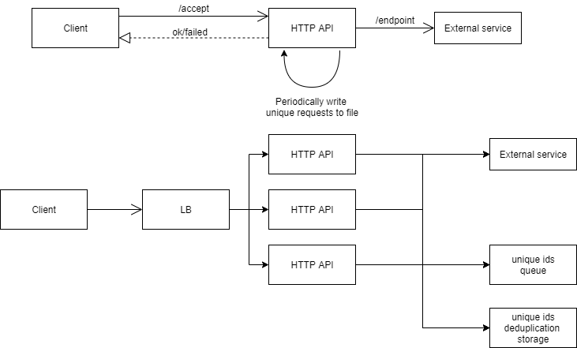

## Intro

This repository presents an application that exposes an HTTP API for handling unique requests.

## Application architecture diagram

## HTTP API

`GET /api/accept?id=123&endpoint=https://www.google.com`
- id = represents the id of the request
- endpoint = represents an HTTP endpoint that should be called by the application

## Technologies

- Spring Boot
- Lombok
- Redis
  - for de-duplicating ids: uses the set data structure for storing unique requests ids
  - as a streaming platform: queue for sending the number of unique requests in the last minute
- JMeter
  - for load testing

If you want to test the application you can use the following Docker Redis image: https://hub.docker.com/_/redis

## Application structure

The application is structured as follows:
- configuration: configuration classes
- controller: controller classes for exposing the HTTP API
- service: business logic for controllers
- model: data classes
- unique.requests.producer: business logic for periodically writing unique ids to redis and log files
- deduplication: business logic for storing unique ids using Redis and Sets

## Running the application

- In order to run the application you need a Redis instance to connect to. 
- Update the `application.properties` for the app with the Redis host and port.

- `./gradlew bootRun`

## Generate jar
`./gradlew bootJar`

## Configure the application

Update the properties in `application.properties`
- api base path
- server port
- Redis host and port
- Redis streaming queue
- Redis set name
